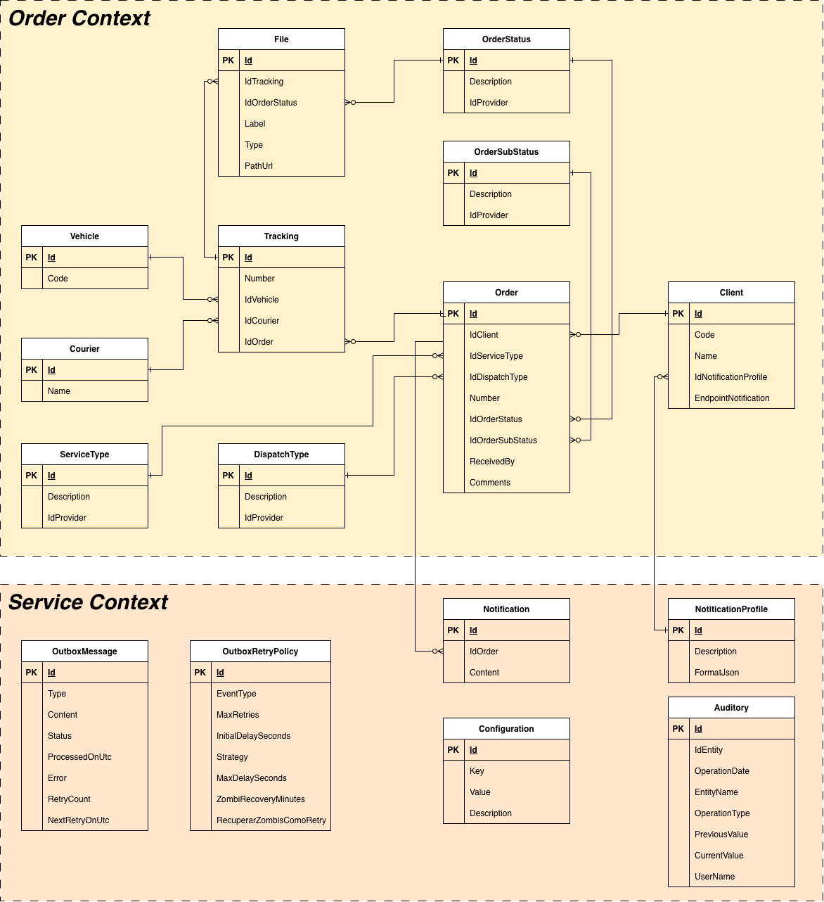
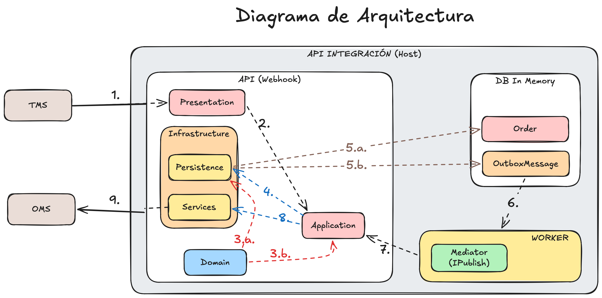

PASOS PARA EJECUCIÓN
1. Situarse en la carpeta Host/Host
2. Ejecutar dotnet build (asegurarse de tener instalado NET 10)
3. Acceder al documentador Swagger: http://localhost:5283/swagger
4. Las credenciales para consumir el api se deben colocar en los headers: 

   **x-client-id**: proveedor-prueba
   **x-client-secret**: Demo-Cliente-2026-X7p9

6. Listo para usarse

Diagrama de Entidad-Relación
De acuerdo al payload entregado, se procedió a identificar las entidades participantes en el proceso. Con información 
mínima se pudo identificar la participación de 2 de negocio: Order y Service. De existir mayor granularidad en los datos 
que son necesarios para el proceso, las entidades participantes podrían formar sus propios contextos. Para este caso, por la 
poca cantidad de entidades se acoplaron al contexto de Order. Este detalle corresponde al enfoque Domain-Driven Design, 
donde se aplicaron principalmente los conceptos de agregados y eventos de dominio.

Adicionalmente se agregaron entidades necesarias para el funcionamiento de api de integración, en este caso
se colocaron dentro del Service Context.

| Componente | Responsabilidad |
|---|---|
| **TMS** | Envía los eventos de transporte al webhook de la API. |
| **Host** | Configura las dependencias y ejecuta la Web API y el worker. |
| **Presentation** | Recibe las solicitudes HTTP y aplica filtros y validaciones de entrada. |
| **Application** | Coordina los casos de uso y sus handlers. |
| **Domain** | Define las entidades, reglas de negocio y eventos de dominio. |
| **Infrastructure.Persistence** | Implementa repositorios y persistencia de entidades y mensajes Outbox. |
| **Infrastructure.Services** | Implementa las llamadas a servicios externos, como Blob Storage y OMS. |
| **Worker** | Consulta el Outbox y procesa los mensajes pendientes. |
| **MediatR** | Publica notificaciones dentro del proceso para que los handlers las atiendan. |

**Flujo de cambio de estado**

1. El TMS envía el payload al webhook.
2. Presentation recibe la solicitud y la deriva al caso de uso correspondiente en Application.
3. Application guarda el mensaje recibido en el Outbox. Tras confirmar el guardado, la API puede responder al TMS sin esperar el procesamiento completo.
4. El worker consulta periódicamente los mensajes pendientes del Outbox.
5. Para un mensaje ProcessTMSPayloadDomainEvent, el worker lo publica mediante MediatR. El handler procesa el payload y crea o actualiza entidades como Order y Tracking.
6. El cambio de estado puede generar un evento, como NotifyChangedOrderStatusDomainEvent, que se guarda en el Outbox.
7. En un ciclo posterior, el worker procesa ese evento. Su handler prepara el payload según la configuración del cliente y lo envía al OMS mediante HTTP.
8. Si el envío falla, el mensaje se conserva para aplicar la política de reintentos; si tiene éxito, se marca como procesado.
Nota: MediatR publica notificaciones dentro de la aplicación; no es un message broker. El Outbox persiste los mensajes y el worker los procesa de forma asíncrona.

**Consideraciones de persistencia**

El cambio de negocio y su mensaje Outbox deben guardarse en la misma transacción para evitar que uno se persista sin el otro. La implementación actual debe cumplir esa condición antes de describir el guardado como atómico.
Si el entorno de prueba usa EF Core InMemory, indícalo como una configuración de pruebas. Para producción se necesita una base de datos persistente que permita conservar el Outbox ante reinicios.

| Patrón o enfoque | Dónde se aplicó |
|---|---|
| **Clean Architecture / arquitectura por capas** | Separación entre Host, Presentation, Application, Domain e Infrastructure. |
| **CQRS básico** | Separación entre comandos y consultas con sus respectivos handlers. No implica que uses bases de datos separadas. |
| **Domain Model y Domain Events** | `Order.ActualizarEstado(...)` contiene comportamiento y puede generar eventos ante cambios de negocio. |
| **Background Job / polling** | Quartz consulta periódicamente el Outbox para procesar lotes de mensajes. |
| **Interceptores de persistencia** | El interceptor de EF Core centraliza comportamiento de auditoría al guardar. |
| **Dependency Injection** | El Host registra servicios, repositorios y otras dependencias. |
| **Outbox** | Persistes mensajes pendientes y un worker los procesa después. |
| **Pipeline/Decorator** | El comportamiento de FluentValidation registrado como `IPipelineBehavior<,>` intercepta comandos antes de sus handlers. |
| **Métodos de fábrica** | Métodos como `Order.Create(...)` o `Client.Create(...)` controlan la construcción de entidades. |
| **Cache-aside** | `MemoryCacheService` consulta la caché y obtiene el valor de su fuente cuando no está disponible. |
| **Repository** | Repositorios genéricos y específicos, como `IOrderRepository`. |
| **Unit of Work** | `IUnitOfWork` centraliza el acceso a repositorios y la confirmación de cambios. |
| **Mediator** | MediatR coordina comandos, consultas y notificaciones dentro del proceso. |
